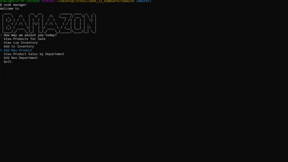

# Bamazon

### Bamazon is a CLI node app that immitates a store front.

## Features

As a customer:  

1. View and 'purchase' products from SQL database.

As a manager:    

1. View products
1. View products with low stock.
1. Increase the stock of a product.
1. Add a new item to the database.

# Setup 

In order to run Bamazon on your machine you will need to create a SQL database.

You must provide a .env file or make sure your SQL database matches these default values:

HOST = "localhost"  
PORT = 3306  
USER = "root"  
DATABASE = "bamazon"  
PASSWORD = "password"  

The .env file should contain your SQL database keys like so:  

```
HOST=#######  
PORT=#######  
USER=#######  
PASSWORD=#######  
DATABASE=#######  
```

You will need to navigate to the root folder and run `npm install`.  

  

# Using Bamazon as a customer

To start Bamazon navigate to the root folder and run `node index`.
Use the prompt menus to view products or make a purchase.

  

# Using Bamazon as a manager

To start Bamazon navigate to the root folder and run `node manager`.
Use the prompt menus to view products, restock or add a product.

  

## Add stock


## Add Product

